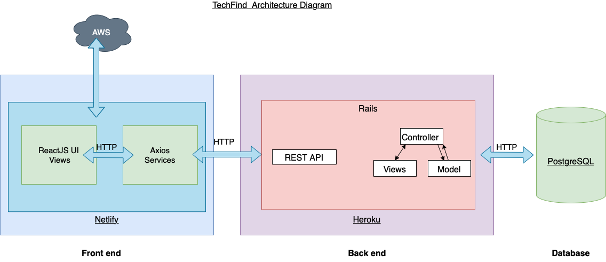

    
     

  <h2 align="center">TechFind</h2>
  <h3 align="center">Coder Academy Assignment 2A & 2B - Term 3</h3>
  

    <a href="https://github.com/BJB-Team/TechFind">Link to Front-end Repository</a>
    ·
    <a href="/">Link to Back-end Repository</a>
    .
    <a href="/">Link to Deployed Website</a>
  

---

## Table of Contents

<!-- TOC depthFrom:1 depthTo:4 withLinks:1 orderedList:0 -->

- [Table of Contents](#table-of-contents)
- [About the Project](#about-the-project)
  - [**Built With (Tech Stack)**](#built-with-tech-stack)
  - [**Statement of Purpose**](#statement-of-purpose)
  - [**Target Audience**](#target-audience)
  - [**Project Management**](#project-management)
  - [**Functionality / Features**](#functionality--features)
    - [**A Job Seeker Features**](#a-job-seeker-features)
    - [**A Job Poster Features**](#a-job-poster-features)
  - [**User Stories**](#user-stories)
    - [As a Seeker](#as-a-seeker)
    - [As a Poster](#as-a-poster)
  - [**Application Architecture Diagram**](#application-architecture-diagram)
  - [**Entity Relationship Diagram (ERD)**](#entity-relationship-diagram-erd)
  - [**Dataflow Diagram**](#dataflow-diagram)
  - [**Wireframes**](#wireframes)
  - [**Third Party Apps/Services**](#third-party-appsservices)
- [Roadmap](#roadmap)
- [Contributing](#contributing)
- [Authors](#authors)
- [Acknowledgments](#acknowledgments)

<!-- /TOC -->

## About the Project

### **Built With (Tech Stack)**

The core programming languages/frameworks used to build this application are:

- Ruby on Rails [Read Docs](https://guides.rubyonrails.org/getting_started.html)
- HTML5 [Read Docs (Not official)](https://developer.mozilla.org/en-US/docs/Web/HTML)
- CSS3 [Read Docs (Not official)](https://developer.mozilla.org/en-US/docs/Web/CSS)
- JavaScript (ES6) [Read Docs](https://262.ecma-international.org/6.0/)
- ReactJS [Read Docs](https://reactjs.org/)
- Postgresql [Read Docs](https://www.postgresql.org/)

### **Statement of Purpose**

The purpose of the TechFind application is to link IT positions with candidates with those skills. Say goodbye to Junior Dev roles seeking 10 years experience in .NET roles. Each Job Poster can assign themselves to a company and create job advertisements to seek out potential employees.

### **Target Audience**

The target audience for this application are people in the technology industry looking for a job board that is specific to their industry.

### **Project Management**

To manage the team for this application a Trello board was set up to help follow an agile methodology. Each team member has been assigned different roles.

- Ben Aitcheson - Organising the documentation and both front and back-end development.

- Jack Kirkwood - Back-end development and Databasing.

- Lukusa (Blaise) Tshitenga - Front-End development, Wireframing and Architecture design.

This is the initial board. Everything from the marking rubric was thrown in and our feature design was started. Colours were chosen for each team member and roles were assigned.

As the deadline for Part A came close, exact roles were determined and delegated and moved into the doing column. Core features were decided upon first with secondary features coming under the 'nice the haves'.

### **Functionality / Features**

Here are some of the features that will be implemented for this application.

Users are split into Job Seekers and Job Posters.

#### **A Job Seeker Features**

A Seeker on sign up will require the user enter:

- Username
- Email
- Password
- Phone Number
- Password Confirmation
- Resume

Each time the Seeker signs in they will go through the authentication process requiring a username/email and a password.

The Seeker can then search jobs by these options:

- Location
- Levels
- Job Categories

The Seeker can also make changes to their own profile once logged in.

#### **A Job Poster Features**

A Poster on sign up will require the user enter:

- Username / Company
- Email
- Password
- Password Confirmation
- Company Details

Each time the Poster signs in they will go through the authentication process requiring a username/email and a password.

The Poster can then post jobs by these options:

- Job description
- Location
- Level
- Job Category
- Salary / Wage (Not mandatory)
- Application Questions (Not mandatory)

The Poster can also make changes to their own profile once logged in and view/modify applications made to their job posting.

A poster can view these about their applicants:

- View seekers email, phone number, resume
- Be able to approve/deny applications
- Sort applications into different levels

### **User Stories**

Here are some User Stories that we built this application from. Each stories outlines how the features will be built following agile methodologies.

#### As a Seeker

> “As a junior developer, I want to see what jobs candidates are posting, so that I can advance my career.”

> "As a job seeker, I can login with my email and a password, so that I have a unique identification."

> "As a job seeker, I can add some details like email or mobile, so that future employers can get in contact with me."

> "As a job seeker, I can search by job categories, so that I can find jobs specific to my ideal career."

> "As a job seeker, I can update and change my profile details, so that as my circumstances change I can stay up to date."

> "As a job seeker, I can upload my resume/CV, so that potential employers can download it when I apply for a job."

#### As a Poster

> “As a job poster, I want to find the right candidates, so that I get the best people for the job.”

> "As a job poster, I can login with my email and password, so that I have a unique identification."

> "As a job poster, I can login under my company profile, so that seekers can see which company I work for."

> "As a job poster, I can add jobs to my company profile, so that I can show future prospects what jobs I am hiring for."

### **Application Architecture Diagram**

As you can see from the Architecture diagram below, this application will have the front-end deployed through Netlify while the back-end will be on Heroku. Axios requests will send information between the two platforms creating a full stack application completely hosted on the cloud.

### **Entity Relationship Diagram (ERD)**

Here's a simple diagram of how our database design will be implemented.

### **Dataflow Diagram**

### **Wireframes**

Here are some high fidelity wireframes for the TechFind application in both Mobile and Desktop.

Initial Landing Page Desktop:

Initial Landing Page Mobile:

### **Third Party Apps/Services**

Here are the third party applications used for TechFinder, in no particular order:

- [Knock](https://github.com/nsarno/knock): A Ruby gem for creating user authentication. A quick alternative to creating authentication from scratch.
- [Heroku](https://www.heroku.com/): This is a cloud platform that lets the user build, deliver, monitor and scale applications. This means a user can host their full stack application on the internet for free. But for this application Heroku will take care of the backend.
- [Netlify](https://www.netlify.com/): This platform allows users to host their front end projects on the cloud for free with a 'freemium' plan. This platform will hold our React frontend as it requires less building than trying to deploy with Heroku.
- [GitHub](https://github.com/): An online platform for users to store public and private coding projects for free. This platform pairs with Heroku and Netlify. Github stores the code and Heroku provides the server to fetch the code and send it to the browser. It is also the platform that allow the team to store the code in a single repository and keeps track of all the git commits and merging.
- [Git](https://git-scm.com/): Version control software that is free. It helps the user keep track of changes allowing them to branch and rollback revisions.
- [Bootstrap 5](https://getbootstrap.com/): Bootstrap makes putting HTML and CSS together on the web browser simple. By streamlining the code required visually appealing layouts can be
- [Figma](https://figma.com/): This program allows users with little amount of graphic design skills to make mock versions of websites, business cards and other mock ups.
- [Trello](https://trello.com/): This is a project management tool used to keep track of features and items that need to be done. Our Trello board can be viewed [here](https://trello.com/b/U2Pme2ea/project-management).
- [Git Guardian](https://www.gitguardian.com/): This program scans the users GitHub account to ensure any passwords or keys aren't made public for someone to scrape and use for malicious activities.
- [DB Diagram.io](https://dbdiagram.io/home): A online platform used to give a visual display of the Entity Relationship Diagram for the back end on Find-A-Planner.
- [Visual Studio Code](https://code.visualstudio.com/): The most popular code editing software with plenty of extensions to help code this application. VS Code is owned by Microsoft and is free to use.

## Roadmap

In the future we would like to add ..

---

## Contributing

Contributions are what make the open source community such an amazing place to be learn, inspire, and create. Any contributions you make are appreciated.

1. Fork the Project
2. Create your Feature Branch (`git checkout -b YourBranchName`)
3. Commit your Changes (`git commit -m 'Add a feature/amendment'`)
4. Push to the Branch (`git push origin YourBranchName`)
5. Open a Pull Request

---

## Authors

- Ben Aitcheson - Organising the documentation and both front and back-end development. [Github](https://github.com/benaitcheson) / [Website](https://www.benaitcheson.me/)

- Jack Kirkwood - Back-end development and Databasing. [Github](https://github.com/jkirky82)

- Lukusa (Blaise) Tshitenga - Front-End development, Wireframing and Architecture design. [Github](https://github.com/Blaise122)

---

## Acknowledgments

- Thanks to the team at [Coder Academy](https://www.coderacademy.edu.au/) for their support.
